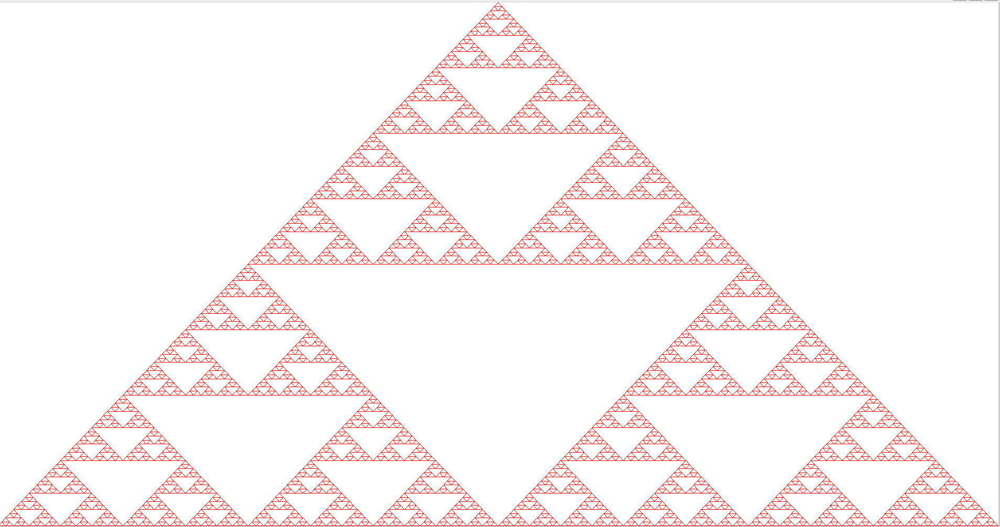

# Sierpinski-Triangle
A simple C++/Freeglut program to recursively create a Sierpinski triangle, with maximum recursion depth passed as a parameter (1-10).
Dependencies: Freeglut.

Compilation on Ubuntu (without usage of make): g++ -o sierpinski Main.cpp Point.cpp Triangle.cpp -lGL -lGLU -lglut

Run: ./sierpinski 7

